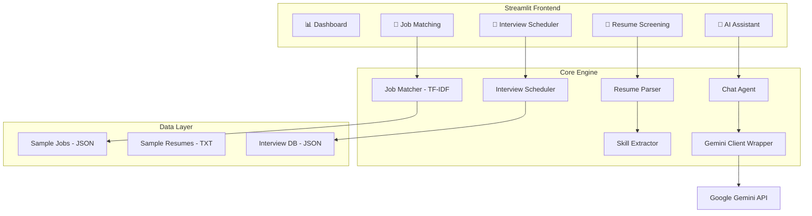

# 🎯 Recruiter AI Agent


## Project Overview

An AI-powered recruitment system that automates and streamlines the hiring process. The system assists recruiters with resume screening, candidate-job matching, interview scheduling, and provides an intelligent AI recruitment assistant — all through a polished, professional dashboard.

**The application works both with and without a Gemini API key.** Without AI, it gracefully falls back to deterministic parsing (regex, keyword matching, TF-IDF) for all core features.

---

## ✨ Features

- 📊 **Dashboard** — Real-time recruitment metrics, job listings preview, pipeline overview, and AI status
- 📄 **Resume Screening** — Upload PDF/TXT or paste text; AI-powered extraction of name, email, phone, skills, education, experience, certifications, and projects
- 🎯 **Job Matching** — TF-IDF + cosine similarity + weighted skill/experience/education scoring with match percentages, skill gap analysis, and recommendations
- 📅 **Interview Scheduler** — Full pipeline management (Applied → Screening → Interview → Selected → Rejected) with time slot suggestions and JSON persistence
- 🤖 **AI Recruiter Assistant** — Gemini-powered chat for resume summaries, interview questions, candidate analysis, and hiring recommendations

---

## 🏗️ Architecture



---

## 🛠️ Tech Stack

| Component | Technology |
|-----------|-----------|
| Language | Python 3.11+ |
| Frontend | Streamlit |
| AI/LLM | Google Gemini (`google-genai` SDK) |
| Text Matching | scikit-learn (TF-IDF + cosine similarity) |
| PDF Parsing | pypdf |
| Data Storage | JSON (file-based) |
| Deployment | Docker / Hugging Face Spaces |

---

## 📁 Project Structure

```
Recruiter-AI-Agent-Development/
├── src/
│   ├── main.py                 # Streamlit app entry point + CSS
│   ├── config.py               # Configuration & environment variables
│   ├── utils.py                # Shared utilities (JSON, validation)
│   ├── gemini_client.py        # Gemini SDK wrapper
│   ├── resume_parser.py        # PDF/TXT parsing + info extraction
│   ├── skill_extractor.py      # Skill extraction & categorization
│   ├── job_matcher.py          # TF-IDF matching engine
│   ├── scheduler.py            # Interview pipeline & scheduling
│   ├── chat_agent.py           # AI recruitment assistant
│   ├── pages/
│   │   ├── __init__.py
│   │   ├── dashboard.py        # Dashboard page
│   │   ├── resume_screening.py # Resume upload & parsing page
│   │   ├── job_matching.py     # Job matching page
│   │   ├── interview_scheduler.py # Scheduler page
│   │   └── ai_assistant.py     # AI chat page
│   └── tests/
│       └── test_smoke.py       # 49 smoke & unit tests
├── data/
│   ├── sample_jobs.json        # 10 sample job descriptions
│   └── sample_resumes/         # 5 sample resumes (TXT)
├── .streamlit/
│   └── config.toml             # Streamlit theme & server config
├── .env.example                # Environment variable template
├── .gitignore
├── requirements.txt
├── Dockerfile                  # Docker deployment (HF Spaces)
├── Procfile                    # Render/Railway deployment
└── README.md
```

---

## 🚀 Installation

### Prerequisites
- Python 3.11 or higher
- pip

### Quick Start

```bash
# Clone the repository
git clone https://github.com/Nevermind-collab/Recruiter-AI-Agent-Development.git
cd Recruiter-AI-Agent-Development

# Create virtual environment
python -m venv venv
source venv/bin/activate  # On Windows: venv\Scripts\activate

# Install dependencies
pip install -r requirements.txt

# Set up environment variables
cp .env.example .env
# Edit .env and add your GEMINI_API_KEY (optional but recommended)

# Run the application
streamlit run src/main.py
```

The app will open at `http://localhost:8501`.

---

## 🔑 Environment Variables

| Variable | Description | Required | Default |
|----------|-------------|----------|---------|
| `GEMINI_API_KEY` | Google Gemini API key for AI features | No* | _(empty)_ |
| `GEMINI_MODEL` | Gemini model to use | No | `gemini-2.0-flash` |

\* The app works without a Gemini API key using deterministic fallbacks. AI features (smart parsing, chat assistant) require the key.

### Gemini API Setup

1. Go to [Google AI Studio](https://aistudio.google.com/apikey)
2. Create a new API key
3. Add it to your `.env` file: `GEMINI_API_KEY=your_key_here`
4. Restart the Streamlit server

---

## 🧪 Testing

```bash
# Run all tests
python -m pytest src/tests/test_smoke.py -v

# Expected: 49 passed
```

Tests cover:
- Configuration loading
- Utility functions (JSON, IDs, validation)
- Gemini client graceful degradation
- Resume parsing (TXT, malformed PDF, sample resumes)
- Skill extraction and categorization
- Job matching scoring
- Interview scheduler CRUD and persistence
- Chat agent without API key
- Sample data integrity

---

## 🚢 Deployment

### Hugging Face Spaces (Recommended)

1. Create a new Space at [huggingface.co/spaces](https://huggingface.co/spaces)
2. Select **Docker** as the SDK
3. Push this repository to the Space
4. Add `GEMINI_API_KEY` as a Space Secret
5. The app auto-deploys on port 7860

The included `Dockerfile` and `.streamlit/config.toml` handle all deployment configuration.

### Render / Railway

1. Connect your GitHub repository
2. Set build command: `pip install -r requirements.txt`
3. Set start command: `streamlit run src/main.py --server.port=$PORT --server.address=0.0.0.0 --server.headless=true`
4. Add `GEMINI_API_KEY` as an environment variable

---

## 📸 Screenshots

<!-- Screenshots will be added here -->

---

## ⚠️ Limitations

- **No persistent database** — Uses JSON file storage (suitable for demo/development)
- **No calendar integration** — Interview scheduler suggests time slots but doesn't sync with external calendars
- **PDF parsing** — Complex PDF layouts may not parse perfectly; plain text resumes work best
- **Single session** — Resume data is stored in Streamlit session state (per-browser session)

---

## 🔮 Future Improvements

- FAISS / sentence-transformer embeddings for semantic job matching
- PostgreSQL or MongoDB for persistent data storage
- Google Calendar API integration for interview scheduling
- Email notifications for candidates
- Multi-candidate comparison dashboard
- Resume scoring rubrics and customizable weights
- Batch resume processing

---

## 👥 Team Members

- **Wangyal Dorjee Bhutia**
- **Shailendra Prasad Yadav**
- **Yuvanshankar M**
- **Megala M**

---

## 📄 License

This project is developed for educational and research purposes.
